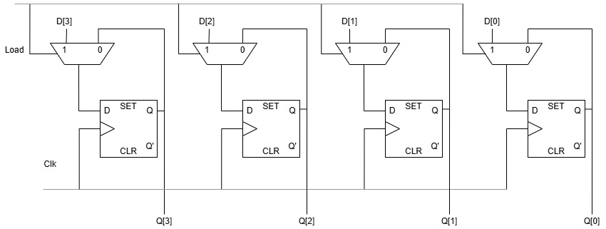

# 4-bit Register

## Overview
Reprogrammed and simulated the 4-bit register in Verilog through two methods in Xilinx Vivado 2024.1:

- In the first method, I defined **output = input** at every rising edge of the clock. Programmed it through dataflow modelling.
- In the second method, I programmed it through module instantiation using four 2x1 Multiplexers and four D flip-flops.
  - In each multiplexer, the select line is the 'load' signal, which is used to decide the operations. If load = 0, it will hold the value and transfer the value to Q, which is the output of the D Flip-flop. Q will transfer the value back to the D-flip-flop. 
  - If load = 1, it will hold the new value, and whatever the value of input D (of the 2x1 MUX, here) will transfer the value to the D flip-flop.
  - So, both functionalities are there. If load = 0, it is retaining the last output and if load = 1, it is loading the new input.

> We can extend the second method for a higher number of bits to be stored. 
