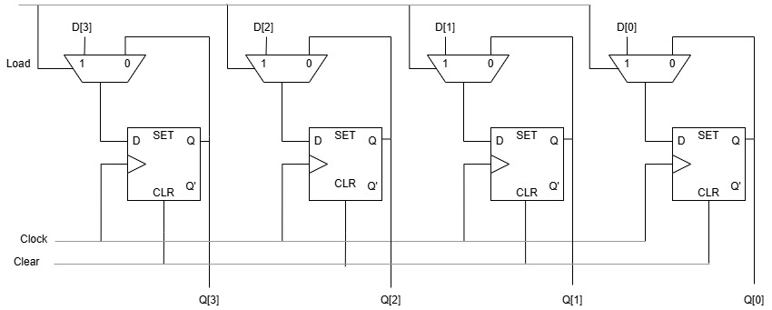

# 4-bit Register (with clear)

## Overview 
Reprogrammed 4-bit register (with clear) Verilog code through if-else conditions in Xilinx Vivado 2024.1, using logic diagram given below. Successfully verified 4-bit register (with clear) by developing Verilog testbench and analyzed its simulation results. 

 

- Here, load and clear decides the operation.
- If clear = 1, load is not considered and output is 0.
- If load = 0, it holds data.
- If load = 1, it loads new value.
- We can extend the same for more number of bits to be stored.
